# EVAL.AI Urban Lane Graph Estimation Challenge


## Evaluation Process


The challenge is split into three distinct phases (or tasks):

- Successor Lane-Graph Prediction (Succ-LGP): Given a BEV input image, the model must predict the successor lane-graph from a agent starting position at the bottom-center of the image. The image resolution is always 256 x 256 pixels.
- Full Lane-Graph Prediction (Full-LGP): Given a BEV input image, the model must predict the full lane-graph that is visible inside the image . The image resolution is always 5000 x 5000 pixels.
- Planning: Same as the Full Lane-Graph Prediction task, but we do not evaluate the quality of the graph directly but evaluate the paths planned on the predicted graph and compare it to the paths planned on the ground-truth graph.

You may submit your predictions to any of the tasks separately. The evaluation process is as follows: We evaluate the respective metrics on the test split and report the results on the leaderboard. We calculate the average of the metrics over all scenes in the test split from all cities. Below, we detail how metrics are averaged across cities and samples.

## Evaluation Metrics

### Successor-LGP and Full-LGP
- TOPO Precision / Recall: Following previous works in road network extraction and lane graph estimation, we use the GEO metric and the TOPO metric. For definitions and details on these metrics, please refer to [1].
- GEO Precision / Recall: Following previous works in road network extraction and lane graph estimation, we use the GEO metric and the TOPO metric. For definitions and details on these metrics, please refer to [1].
- APLS: The APLS metric sums the differences in optimal path lengths between nodes in the ground truth graph G and the proposal graph G0. The APLS metric scales from 0 (worst) to 1 (best).
- Split Detection Accuracy - SDAR: This metric evaluates how accurately a model predicts the lane split within a circle of radius R pixels from a given ground truth lane split
- Graph IoU: This metric measures the intersection-over-union (IoU) of two graphs rendered as a binary image, where pixels closer than d = 5 pixels are assigned the label 1 and the remaining pixels the label 0. Equivalent to the evaluation of semantic segmentation models, we determine the IoU values for the non-zero pixels. For definitions and details on these metrics, please refer to [2]

### Planning
To evaluate the planned routes, we compare the mean minimum distance (MMD), the mean route endpoint distance (MED) between the paths on the predicted graph and the ground truth graph, respectively, and the success rate (SR) of the planned paths. For each tile, we sample 100 random start and end nodes on the ground truth graph. For each start and end node, we compute the shortest path between the two nodes on the ground truth graph. We then compute the shortest path between the two nodes on the predicted graph. We then compute the MMD, MED, and SR metrics. Details on these metrics are as follows:
- MMD: Mean minimum distance between the shortest path on the predicted graph and the shortest path on the ground truth graph.
- MED: Mean endpoint distance between the end node of the shortest path on the predicted graph and the end node of the shortest path on the ground truth graph.
- SR: Fraction of cases in which a path between start and goal exists on the predicted graph.

## Submission Format
We expect the submission to be a single .pkl (pickle) file. The submission file should contain a dictionary with the following keys: A given prediction result can be encoded as a dictionary R: R[city][split][sample_id]

```python
result = {
    "austin": {
        "eval": {
            sample_id: nx.DiGraph,  # the predicted lane graph for sample sample_id in city austin
            ...                     # all other samples in city austin
        },
        "test": {
            sample_id: nx.DiGraph,  # the predicted lane graph for sample sample_id in city austin
            ...                     # all other samples in city austin        ...
        }
    },
   "detroit": {
        ...
    },
   ...
}
```

You may export a dictionary to a pickle file using the following code snippet:

```python
import pickle

predictions_dict = {...}  # dictionary with the above structure

with open('predictions.pickle', 'wb') as f:
    pickle.dump(predictions_dict, f)
```


This structure applies for all three tasks. The Full-LGP and the Planning task use the exact same predictions to calculate the metrics. 
The Successor-LGP task has more samples for each city the successor graphs are only defined for small crops. 

We share example submission files for each task in the `example_submissions` folder.

The sample ID's equal the filename of the respective image or .pth file. For example, the sample id for the image 
`paloalto_24_15359_8592.png` is `paloalto_24_15359_8592`. Or ID `detroit_136_10700_35709_001_004-rgb` for 
file `detroit_136_10700_35709_001_004-rgb.pth`.


## Calculation of Metrics Across Cities and Samples


A given evaluation result for a task can be encoded as a dictionary `R`: `R[city][split][sample][metric_name]`

The dictionary keys are:
- `city`: one of the 6 cities (e.g. `"austin"`)
- `split`: either `"eval"` or `"test"`
- `sample_id`: the id of the sample.
- `metric_name`: any of the metrics available for the given task (e.g. `"topo_recall"` or `"apls"`)

In order to pool the values across cities and samples, we use the following pooling strategy
- `city`: `Mean` (we average the metrics across cities)
- `split`: `None` (we do not average the metrics across splits)
- `sample`: `Mean` (we average the metrics across samples)
- `metric_name`: `None` (we do not average the metrics across metrics)

If any of the metrics values are missing, we will report a dummy for the respective metrics. 
A missing value might be introduced by a missing graph or an ill-formed graph leading to an error in any of the metrics. 
In case of missing values in `R`, we insert the following metrics values for pooling the values:

- TOPO Precision / Recall: `0.0`
- GEO Precision / Recall: `0.0`
- APLS: `0.0`
- Split Detection Accuracy: `0.0`
- Graph IoU: `0.0`
- MMD: `5000` (5000 is the tile width in pixels --> maximum value for the distance)
- MED: `5000` (5000 is the tile width in pixels --> maximum value for the distance)
- SR: `0.0`


### Planning
To evaluate the planned routes, we compare the mean minimum distance (MMD), the mean route endpoint distance (MED) between the paths on the predicted graph and the ground truth graph, respectively, and the success rate (SR) of the planned paths. For each tile, we sample 100 random start and end nodes on the ground truth graph. For each start and end node, we compute the shortest path between the two nodes on the ground truth graph. We then compute the shortest path between the two nodes on the predicted graph. We then compute the MMD, MED, and SR metrics. Details on these metrics are as follows:
- MMD: Mean minimum distance between the shortest path on the predicted graph and the shortest path on the ground truth graph.
- MED: Mean endpoint distance between the end node of the shortest path on the predicted graph and the end node of the shortest path on the ground truth graph.
- SR: Fraction of cases in which a path between start and goal exists on the predicted graph.


These metrics are inserted in the leaderboard. The final score of the method is the mean of all metrics for the given task.

### Missing Annotations

For some of the tiles in the dataset, not all lane annotations are available. To account for this, we mask out all predicted lanes that are too far away from the ground truth lanes.


# Local Evaluation


We expect the submission for each of the tasks (Full-LGP, SuccessorLGP, Planning) and each of the splits (eval/test)
to be a single .pickle file. The submission file should contain a dictionary with the format as specified above.

The aerial images used as input for the models are available in the respective sub-directories of our UrbanLaneGraph Dataset. For details, please visit [DOWNLOAD.md](../urbanlanegraph_dataset/DOWNLOAD.md)

We prepared an evaluation script in `test_evaluator.py` that evaluates a submission pickle file against the ground truth annotations.

The following code snippet shows how to use the `GraphEvaluator()` class:


```python
from urbanlanegraph_evaluator.evaluator import GraphEvaluator

graphs_gt = {...} # dictionary with ground truth graphs
graphs_pred = {...} # dictionary with predicted graphs

# Define list of cities to evaluate
city_names = [
    "austin",
    "detroit",
    "miami",
    "paloalto",
    "pittsburgh",
    "washington"
]

# Define list of metrics to evaluate
metric_names = ["TOPO Precision",
                "TOPO Recall",
                "GEO Precision",
                "GEO Recall",
                "APLS",
                "SDA20",
                "SDA50",
                "Graph IoU"
                ]

split = "eval"  # either eval or test

metrics_all = {}


for city in city_names:
    metrics_all[city] = {}
    metrics_all[city][split] = {}

    for sample_id in graphs_gt[city][split]:
        metrics_all[city][split][sample_id] = {}

        if graphs_pred[city][split][sample_id] is None:
            print("No prediction for sample", sample_id)
            metrics_sample = {metric_name: 0.0 for metric_name in metric_names}
        else:

            evaluator = GraphEvaluator()

            metrics = evaluator.evaluate_graph(graphs_gt[city][split][sample_id],
                                               graphs_pred[city][split][sample_id],
                                               area_size=[256, 256])

            metrics_sample = {
                "TOPO Precision": metrics['topo_precision'],
                "TOPO Recall": metrics['topo_recall'],
                "GEO Precision": metrics['topo_precision'],
                "GEO Recall": metrics['geo_recall'],
                "APLS": metrics['apls'],
                "SDA20": metrics['sda@20'],
                "SDA50": metrics['sda@50'],
                "Graph IoU": metrics['iou'],
            }

        metrics_all[city][split][sample_id].update(metrics_sample)
```


# Evaluation on eval.ai Challenge Server

The evaluation on the Eval.ai challenge server is performed the same way as the local evaluation. If your
evaluation submission works locally, it should also work on the Eval.ai challenge server.

The aerial images used as input for the models are available in the respective sub-directories of our UrbanLaneGraph Dataset. For details, please visit [DOWNLOAD.md](../urbanlanegraph_dataset/DOWNLOAD.md)


In case you encounter any issues, please contact us at
[zuern@informatik.uni-freiburg.de](mailto:zuern@informatik.uni-freiburg.de).


# Example Visualizations

## Successor-LGP


| Sample ID                         | Aerial Image                                     | Annotation Visualization                         |
|-----------------------------------|--------------------------------------------------|--------------------------------------------------|
| `austin_40_14021_51605_001_000`   | 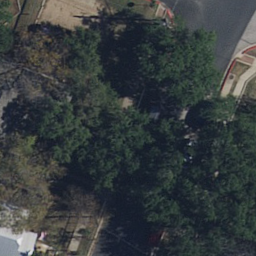   | 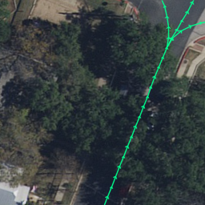   |
| `austin_83_34021_46605_010_004`   | 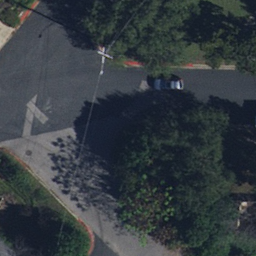   | 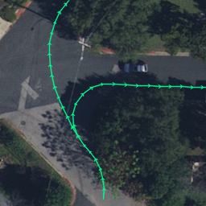   |
| `detroit_165_25700_30709_005_003` | 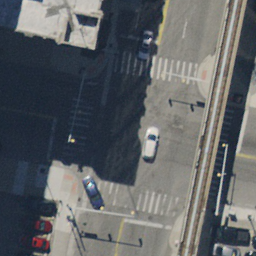 | 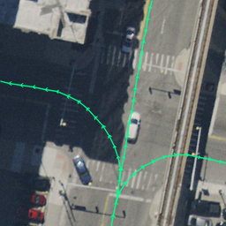 |
| `detroit_165_25700_30709_029_018` |  | 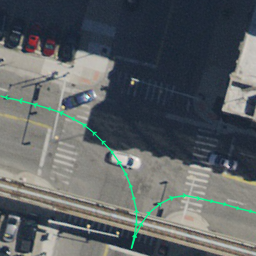 |
| `miami_185_41863_18400_001_002`   | 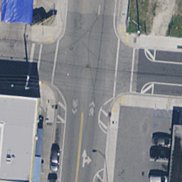   | 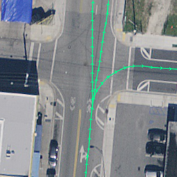   |
| `miami_185_41863_18400_013_003`   | 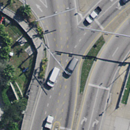   | 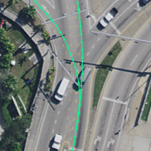   |
| `miami_185_41863_18400_031_010`   | 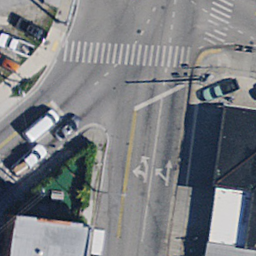   | 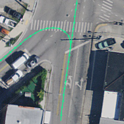   |
| `paloalto_43_25359_23592_001_007`      | 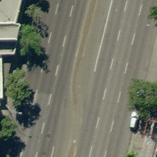      | 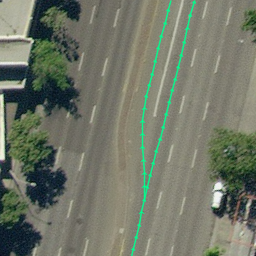      |
| `paloalto_43_25359_23592_001_018`      | 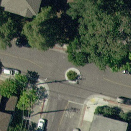      | 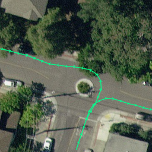      |
| `paloalto_62_35359_38592_009_003`      | 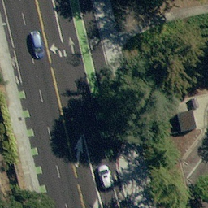      |       |


## Full-LGP

TODO
